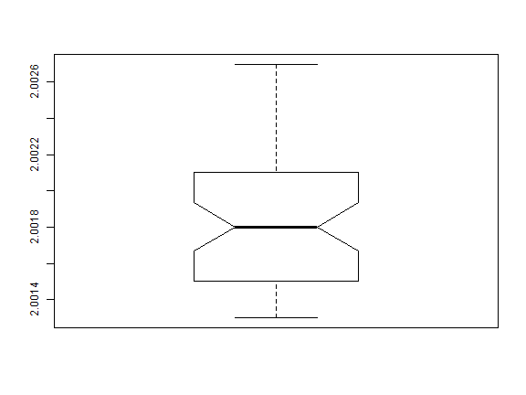

<style>
.tiny-code pre code {
  font-size: 1.2em;
}
.small-code pre code {
  font-size: 1.2em;
}
.medium-code pre code {
  font-size: 1.4em;
}
</style>

Additional Graphics
========================================================
autosize: true
font-family: 'Garamond'

## Statistical Programming


Concepts
========================================================

- Histograms
- Box-Whisker
- QQ plots

========================================================

One of the most common assumptions in statistics at that data or errors are normally distributed random variables; the probability of observing particular values can be predicted from the Gaussian, knowing only a mean and a standard deviation.

There are some formal techniques to test for normality, but I like graphs, so we'll demonstrate some graphing techniques that will be useful for examining this assumption.


========================================================

We'll start with the Mavro data set from http://www.itl.nist.gov/div898/strd/univ/mavro.html .
This is a series of measurements of light transmitted through a particular filter. We might expect this to be a series of samples from a single normal distribution.


```r
Mavro <- c(2.00180, 2.00170, 2.00180, 2.00190, 2.00180, 2.00170, 2.00150, 2.00140, 2.00150, 2.00150, 2.00170, 2.00180, 2.00180, 2.00190, 2.00190, 2.00210, 2.00200, 2.00160, 2.00140, 2.00130, 2.00130, 2.00150, 2.00150, 2.00160, 2.00150, 2.00140, 2.00130, 2.00140, 2.00150, 2.00140, 2.00150, 2.00160, 2.00150, 2.00160, 2.00190, 2.00200, 2.00200, 2.00210, 2.00220, 2.00230, 2.00240, 2.00250, 2.00270, 2.00260, 2.00260, 2.00260, 2.00270, 2.00260, 2.00250, 2.00240)
```


Distribution Plots
========================================================

There are two graphs linked to this data set (http://www.itl.nist.gov/div898/strd/univ/graphics/mavro.html), a histogram and a uniform probability plot. These plots are used to determine if a data set represent a single random variable of an expected distribution (i.e. normally distributed).

We'll look at the histogram first.


Mavro Histogram
========================================================

We plot the histogram in R:

```r
hist(Mavro)
```


Histogram and Summary
========================================================
Let's relate the histogram to `summary`

```r
summary(Mavro)
```

```
    Min.  1st Qu.   Median     Mean  3rd Qu.     Max. 
2.001300 2.001500 2.001800 2.001856 2.002100 2.002700 
```
The summary tells use that all values in the `Mavro` data are between 2.0013 and 2.0027, and the midpoint, with 50% of the values on either side, is 2.0018. Let's add these to the histogram.


Histogram and Range.
========================================================


```r
hist(Mavro)
abline(v=median(Mavro), col="blue")
abline(v=c(min(Mavro), max(Mavro)), col="red",lty=3)
```


Histogram and Quartiles
========================================================
class: small-code

For completeness, we can add the 25% and 75% quartiles.


```r
mavro.quant <- quantile(Mavro)
hist(Mavro)
abline(v=mavro.quant, col=c("red","green","blue","green","red"), lty=c(3,2,1,2,3))
```


Histogram and Quartiles
========================================================
The histogram looks skewed to the left, and `summary` helps confirm that - there is a greater difference between median and max than between min and median. This might be an issue if we need to assume the data follow a normal distribution, where we expect equal distance from the median to either extreme.


Normal Quartiles
========================================================

We can simulate the histogram from a normal distribution, of the same size as the `Mavro` data with the same mean and standard deviation by


```r
set.seed(111111)
sim.norm <- rnorm(length(Mavro), mean=mean(Mavro), sd=sd(Mavro))
sim.quant <- quantile(sim.norm)
```

We'll do this to have something more like a normal distribution to compare to `Mavro`

Normal Quartiles
========================================================
class: small-code


```r
hist(sim.norm)
abline(v=sim.quant[3],col="blue")
abline(v=c(sim.quant[c(2,4)]),col="green", lty=2)
abline(v=c(sim.quant[c(1,5)]),col="red", lty=3)
```


Plotting Quantiles
========================================================
class: small-code

Plotting quantiles provides a visual depiction of the data, comparable to `summary`. This type of graphic is most commonly produced as a box-whisker plot.


```r
boxplot(Mavro)
```


Box-Whisker 
========================================================
class: small-code

The *box* represents the 25%-75% interquartile (IQR) range, while the extremes are indicated by *whiskers*. The IQR can be thought of as the *middle fifty* between the two *hinges* at 25% and 75%. We can extract these values in R by:

```r
boxplot.stats(Mavro)
```

```
$stats
[1] 2.0013 2.0015 2.0018 2.0021 2.0027

$n
[1] 50

$conf
[1] 2.00166593255 2.00193406745

$out
numeric(0)
```


Whiskers
========================================================

We can control the whiskers to help identify outliers. 

Typically, the length of the whiskers is a proportion the inter-quartile range. In base R, the proportion is specified by `range`, and defaults to 1.5. The whisker will be extended to the most extreme value in the data, or to `range*IQR`, whichever is smaller.  Any values outside the whiskers are plotted as single points.

 

Whiskers
========================================================
class: small-code


```r
par(mfrow=c(1,3))
boxplot(Mavro,range=1.5); 
boxplot(Mavro,range=0.75); boxplot(Mavro,range=0.38)
```


Waist	
=========================================================
class: small-code

A notch or *waist* can be added to the box plot. This represents an error of the median, $\pm 1.58 \times IQR / \sqrt{n}$. This can be used to approximate whether two medians are different.


```r
boxplot(Mavro,notch=TRUE)
```




Groups
=========================================================
As suggested in the last slide, boxplots may be useful as a simple summary of different groups. Typically, any bar plot that represents a summary of means can be made more informative using box-whisker plots.

Stacked Data
=========================================================
class: small-code

Consider the atomic weight of silver data set. We can produce summary statistics for these data by


```
Error in file(file, "rt") : cannot open the connection
```
